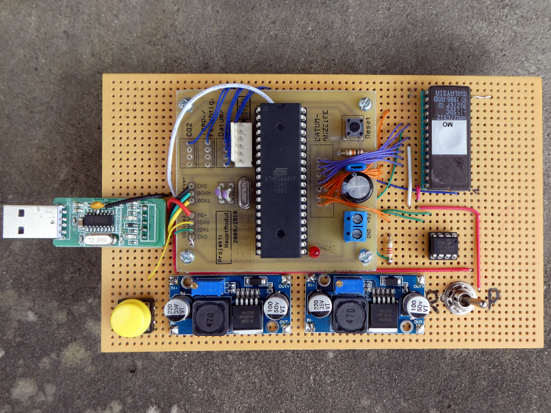

# 27C512 EPROM Programmer

## All infos on: <https://www.weigu.lu/microcontroller/eprom_programmer/index.html>

## Some infos

In a school project, the goal is to refurbish two old drink dispenser and bring these old devices up to date, and allow them to function for several more years.
As the firmware of one of the machines was outdated, we needed a copy of an `EPROM 27C512`, containing the firmware.

After looking at the data sheet, it was obvious that a simple and good solution would be an Arduino based programmer. Other old programmer need a PC with parallel port and old software. Much too complicated.

So I recycled an old ATmega644 project, "Arduinoized" it, added two DC-DC Boost converter and an I²C EEPROM, and ready was the EPROM Programmer.
No PC and no shift register are needed. When pressing the (yellow) button in `READ` mode the EPROM is read and written to the I²C EEPROM. After switching into `PROGRAM` mode and pressing the button the EPROM is programmed by copying the EEPROM content.